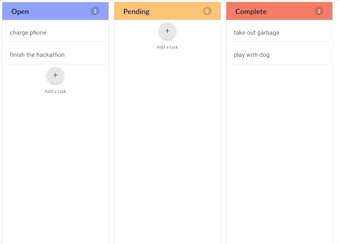

# BadAss KanBan 

The result of a weekend hackathon - BadASS Kanban is a web application for users to track their progress on tasks for a project (and enjoy the completion of each task). 

## Live Demo

https://demo-badass-kanban.adambotma.com/

## Technologies Used
  * ReactJS
  * CSS3
  * HTML5
  * Material-UI
  

## Functionality Overview 
  * User can CRUD a task
  * User can CRUD a column
  * User can order tasks within a column by dragging tasks
  * User can move tasks to new columns by dragging them
  * User can rearrange the columns order by dragging them 
  * User can see progress of overall task completion via a progress bar
  * User can receive success badges for every 5 completed tasks
  * User can enjoy a small confetti (and easy to clean) celebration with each completed task 
  

## Get Started with the app
1. Clone this repo
2. install dependencies
   ~~~ 
   npm install
   ~~~
3. Run the Dev Server
   ~~~ 
   npm start 
   ~~~ 

## Screenshots

Moving Tasks Between Columns:

Completing a Task:

